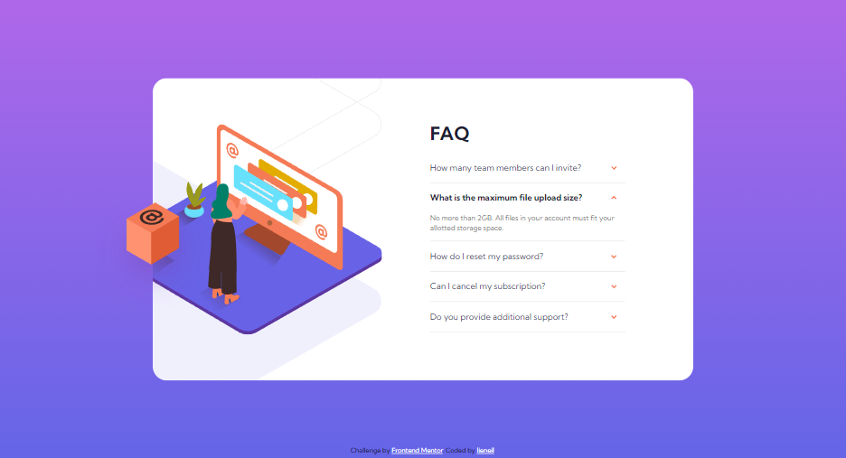
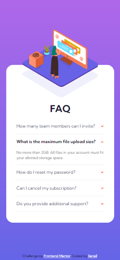

# Frontend Mentor - FAQ accordion card solution

This is a solution to the [FAQ accordion card challenge on Frontend Mentor](https://www.frontendmentor.io/challenges/faq-accordion-card-XlyjD0Oam). Frontend Mentor challenges help you improve your coding skills by building realistic projects. 

## Table of contents

- [Overview](#overview)
  - [The challenge](#the-challenge)
  - [Screenshot](#screenshot)
  - [Links](#links)
- [My process](#my-process)
  - [Built with](#built-with)
  - [What I learned](#what-i-learned)

## Overview

### The challenge

Users should be able to:

- View the optimal layout for the component depending on their device's screen size
- See hover states for all interactive elements on the page
- Hide/Show the answer to a question when the question is clicked

### Screenshot




### Links

- [Live Demo](https://njvs.github.io/Faq-accordion-card/)

## My process

### Built with

- Semantic HTML5 markup
- CSS custom properties
- [SASS/SCSS](https://sass-lang.com) - CSS with superpower
- Flexbox
- Vanilla Javascript

### What I learned

I learned that `height: 0` to `height: auto` will not trigger a css transition, so I tried using `max-height: 0` to `max-height: 500px`. But theres is a problem using this approach, the animation looks delayed if the height of fully expanded panel is less than the set max height. Sure its unnoticeable, if the accordion can expand morethan one panels, but I design my accordion to only expand one panel at a time. To solve this problem, I need to get the acctual height of the panel, but I cant find CSS method for that. So I just use javascript `scrollHeight` property to do that.

A single click event on the `<div class="accordion">` is enough, but only runs if the `event.target` is a `<button class="accordion-button">`. If there are more than one `<div class="accordion">`, I can just use `querySelectorAll()` and add click event for each accordion. But in this case, there are only one accordion so theres no need to do that.
```javascript
document.querySelector('.accordion').addEventListener('click', event => {
  const target = event.target;

  if (target.classList.contains('accordion-button')) {    
    const isActive = target.classList.contains('active')

    // close all expanded accordion, 
    // this will also serve as a "close accordion" if the accordion is already active
    event.currentTarget.querySelectorAll('.accordion-item').forEach(item => {
      item.querySelector('button.accordion-button').classList.remove('active');
      item.querySelector('.accordion-content').removeAttribute('style');
    });

    if (!isActive) {
      // add active class on target
      target.classList.add('active');
      // add dynamic height to accordion content
      const accordionContent = target.closest('.accordion-item').querySelector('.accordion-content');
      accordionContent.style.maxHeight = `${accordionContent.scrollHeight}px`
    }
  }
});
```

